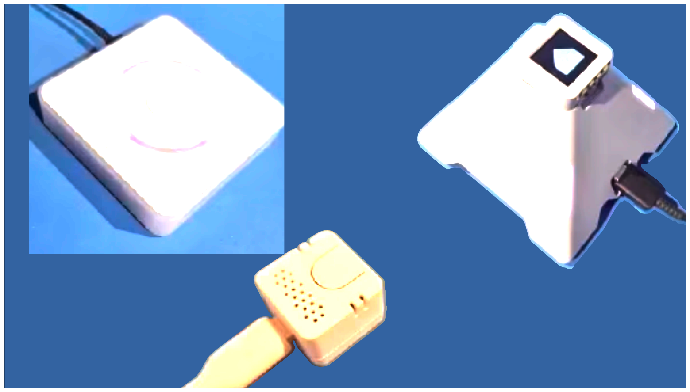

# VIKI_ — a mostly-local, mildly judgemental home assistant

> Companion notes for the EMF Camp July 2026 talk *"Building a mostly-local, mildly judgemental home assistant (aka VIKI_'s origin story)"*.

## [Watch the Video](https://media.ccc.de/v/emf2026-88-1-building-a-mostly-local-mildly-judgemental-home-assistant)

This is the story (and the links, configs and bodges) behind replacing Alexa with a custom-voiced, slightly tsundere Home Assistant voice personality — kept local and cheap where possible, without local LLMs.

If you were in the room: thanks for coming. Everything I waved at on slides is collected here so you can actually build your own — including the few [glue Python scripts](./scripts/) that hold it all together. Questions → **mark@esoom.com**.

A few of the samples didn't play on stage, and it turns out these were ones that I saved in 22kHz format. While they play through the speakers and through my HDMI Amp just fine, the HDMI sink used on stage didn't support that format, and a known issue with the Macbook means rather than resample and send a working sample, it just gets dropped.  

---

## The pipeline

Home Assistant's voice stack has four stages. The whole talk is just replacing each one with something better (or at least funnier). Each stage has its own page:

| Stage | Default | What I did | Page |
|---|---|---|---|
| 🔔 **Wakeword** | microWakeWord (ESPHome) | Trained my own `"hey_viki"` | [./01-wakeword.md](./01-wakeword.md) |
| 🗣️ **Speech-to-Text** | faster-whisper (tiny-int8) | Switched to Azure STT | [./02-speech-to-text.md](./02-speech-to-text.md) |
| 🧠 **Processing** | HA intents | Personality automations + optional Gemini LLM | [./03-processing.md](./03-processing.md) |
| 🔊 **Text-to-Speech** | Piper (default voice) | Trained a custom anime `viki` voice | [./04-text-to-speech.md](./04-text-to-speech.md) |

The hardware is the easy part: a Home Assistant Voice PE (~£60), an M5Stack ATOM Echo, or the AtomS3R "pyramid" — all ESP32s running ESPHome with a mic array, speaker, buttons and LEDs. They work out of the box, and it's all open source, so we just take over the bits we want to change.

### Where to buy

| Device | Official / store | Notes |
|---|---|---|
| **Home Assistant Voice PE** | [home-assistant.io/voice-pe](https://www.home-assistant.io/voice-pe/) (routes to regional shops) · UK: [The Pi Hut](https://thepihut.com/products/home-assistant-voice-preview-edition), [Pimoroni](https://shop.pimoroni.com/en-us/products/home-assistant-voice) | ~£60 / $59 MSRP; plug-in, no assembly |
| **M5Stack ATOM Echo** | [M5Stack store](https://shop.m5stack.com/products/atom-echo-smart-speaker-dev-kit) · UK: [The Pi Hut](https://thepihut.com/products/atom-echo-smart-speaker-dev-kit) | The "$13 voice assistant" — [HA guide](https://www.home-assistant.io/voice_control/thirteen-usd-voice-remote/) |
| **M5Stack AtomS3R + Atomic Echo Base** (the "pyramid") | [AtomS3R-AI Chatbot kit](https://shop.m5stack.com/products/atoms3r-ai-chatbot-kit-8mb-psram) · [M5 HA setup guide](https://docs.m5stack.com/en/homeassistant/voice_assistant/atoms3r_with_atomic_echo_base_voice_assistant) | AtomS3R has the 0.85″ screen; the pyramid is a case |

---

## VIKI_ as of June 2026

| 🔔 Wakeword | 🗣️ Speech-to-Text | 🧠 Personality | 🔊 Text-to-Speech |
|---|---|---|---|
| microWakeWord — `hey_viki` (Voice PE) | Azure STT (Microsoft) | Intents + Blueprints + Automations (HA OS) + LLM (Gemini) | Piper — `viki` voice |

Where it lands: mostly local, no local LLM, about £2 a month. Microsoft for STT is an easy win, being free, fast, accurate and private. A cloud LLM isn't essential and carries privacy trade-offs, but only the bits that can't be handled locally go to Google, for a couple of quid a month. I can live with that.

Character arc: VIKI_ started tsundere (cold, prickly — *"I-it's not like I wanted to help you"*), and I'm experimenting with deredere (warmer, more helpful, a one-word prompt change). The trade-off is that deredere keeps inventing pet names (sweetie, poppet), but at least they're for everyone. LLM sessions are short and she doesn't remember across them; this is a fun voice assistant, not a companion.

*Built by joining a lot of existing pieces together — I didn't find anything else that went quite this far. Questions welcome mark@esoom.com.*
