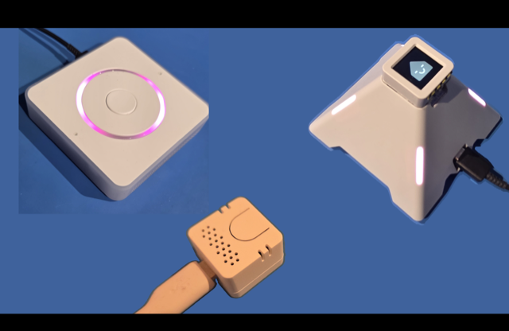

# Hardware

[← Back to talk notes](emf-talk-notes.md)

The hardware used for the EMF Camp build. The hardware is the easy part: a
Home Assistant Voice PE, an M5Stack ATOM Echo, or the AtomS3R "pyramid", all
are ESP32s running ESPHome with a mic array, speaker, buttons and LEDs. They
work out of the box, and it's all open source, so we just take over the bits
we want to change.

## Where to buy

| Device | Official / store | Notes |
|---|---|---|
| **Home Assistant Voice PE** | [home-assistant.io/voice-pe](https://www.home-assistant.io/voice-pe/) · UK: [The Pi Hut](https://thepihut.com/products/home-assistant-voice-preview-edition), [Pimoroni](https://shop.pimoroni.com/en-us/products/home-assistant-voice) | ~£60 |
| **M5Stack ATOM Echo** | [M5Stack store](https://shop.m5stack.com/products/atom-echo-smart-speaker-dev-kit) · UK: [The Pi Hut](https://thepihut.com/products/atom-echo-smart-speaker-dev-kit) | The "$13 voice assistant" — [HA guide](https://www.home-assistant.io/voice_control/thirteen-usd-voice-remote/) |
| **M5Stack AtomS3R + Echo Base** (the "pyramid") | [AtomS3R-AI Chatbot kit](https://shop.m5stack.com/products/atoms3r-ai-chatbot-kit-8mb-psram) · [M5 HA setup guide](https://docs.m5stack.com/en/homeassistant/voice_assistant/atoms3r_with_atomic_echo_base_voice_assistant) | AtomS3R has the 0.85″ screen; the pyramid is additional |

[← Back to talk notes](emf-talk-notes.md)
